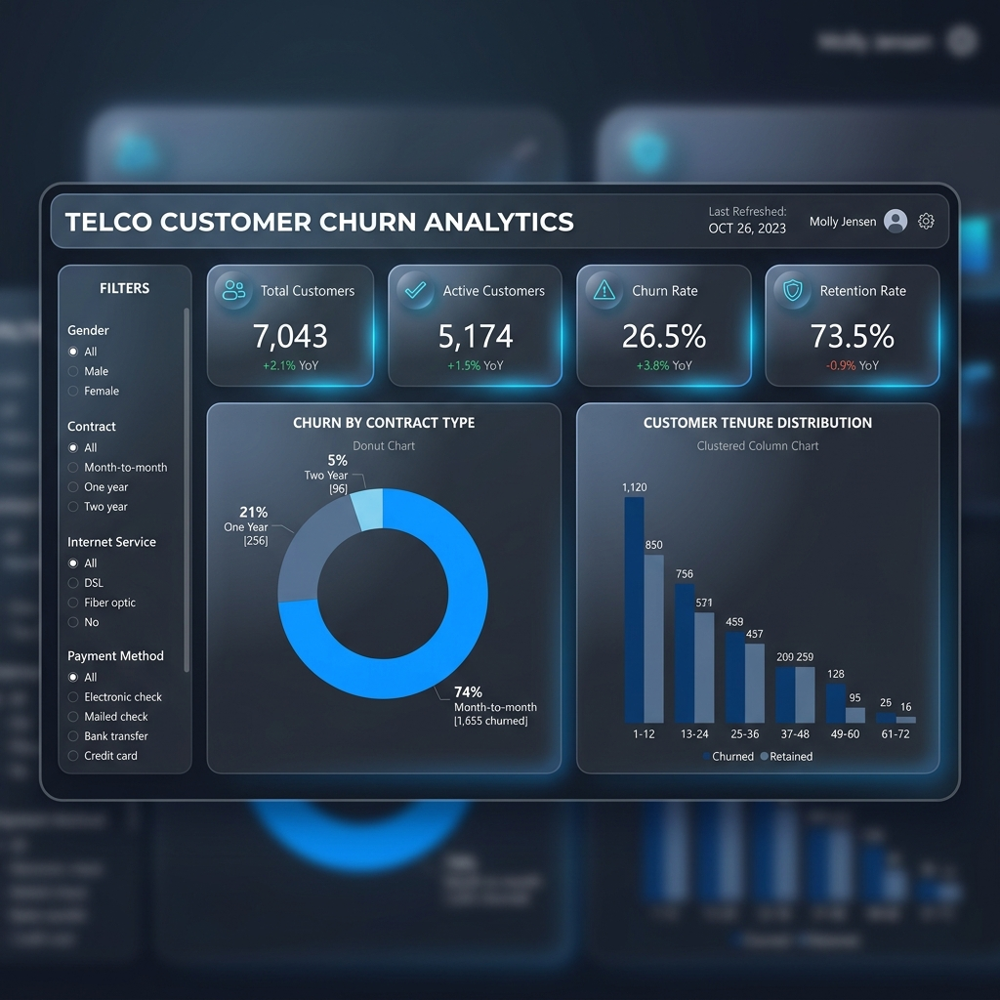
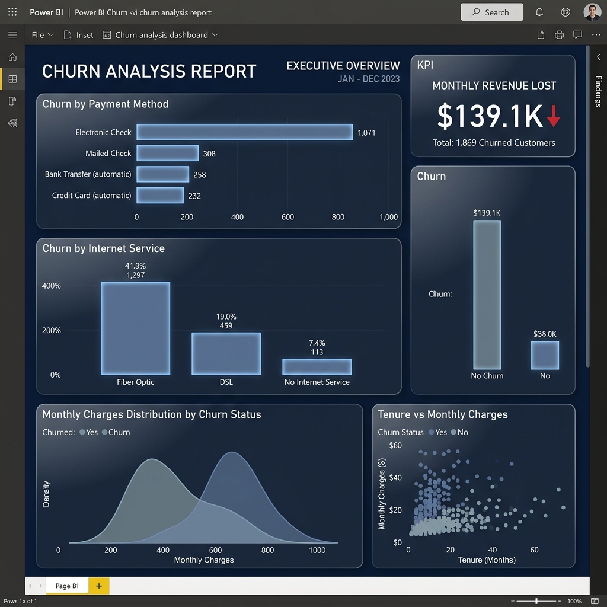
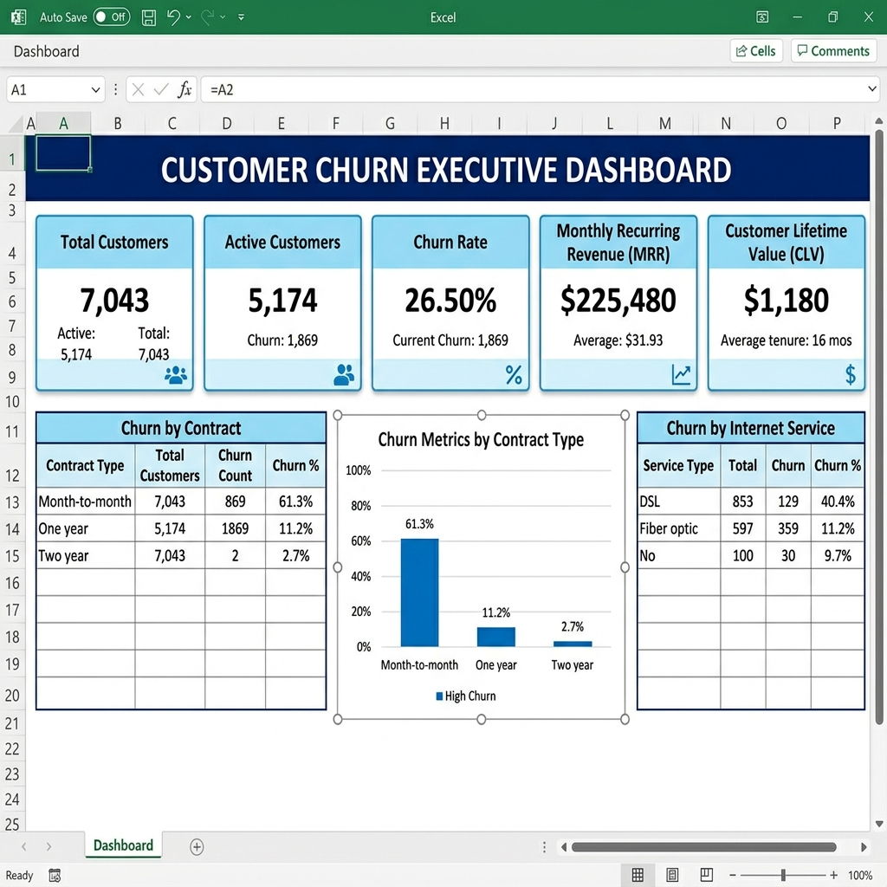

# Telco Customer Churn Analysis

An end-to-end data analytics and business intelligence project using **Python (Pandas, NumPy, Matplotlib, Seaborn)**, **SQL (Staging, Normalized tables, and 32 analytical queries)**, **Excel (live calculations & embedded charts)**, and **Power BI (DAX metrics & high-fidelity mockup visual layouts)** to study customer retention and billing metrics.

## Project Overview
This project performs an executive-level analysis of the **IBM Telco Customer Churn Dataset** (7,043 customers). The goal is to isolate customer demographics, subscription service packages, billing ranges, and contract terms that drive customer churn, and calculate monthly revenue leakages.

---

## Folder Structure

```text
customer-churn-analysis/
│
├── README.md                              # Project overview and business summary (this file)
├── .gitignore                             # Git exclusions (data/raw, cached, python envs)
├── requirements.txt                       # Project python dependency list
│
├── data/
│   ├── raw/
│   │   └── telco_customer_churn.csv       # Original dataset downloaded from GitHub
│   ├── processed/
│   │   └── telco_customer_churn_cleaned.csv  # Cleaned dataset (Pandas output)
│   └── exports/
│       ├── churn_summary.csv              # Overall baseline indicators
│       ├── churn_by_contract.csv          # Contract vs Churn volumes
│       ├── churn_by_payment_method.csv    # Payment channel vs Churn metrics
│       └── churn_by_internet_service.csv  # Broadband types vs Churn splits
│
├── notebooks/
│   └── customer_churn_analysis.ipynb      # Integrated Jupyter notebook combining ETL & EDA
│
├── python/
│   ├── data_cleaning.py                   # Script handling typecasting and missing TotalCharges
│   ├── feature_engineering.py             # Script adding TenureGroup and binary mappings
│   ├── exploratory_data_analysis.py      # Script generating seaborn boxplots and timelines
│   └── export_data.py                    # Script creating aggregated report exports
│
├── sql/
│   ├── 01_create_database.sql             # SQL DB Setup
│   ├── 02_create_tables.sql               # Star Schema table definitions (Dim/Fact model)
│   ├── 03_data_cleaning.sql               # SQL data validation and null-detection scripts
│   ├── 04_basic_analysis.sql              # SQL Queries 1-8: Customer baselines and averages
│   ├── 05_intermediate_analysis.sql       # SQL Queries 9-16: Intermediate segment aggregations
│   ├── 06_advanced_analysis.sql           # SQL Queries 17-24: Window functions, deciles, and CTEs
│   └── 07_business_queries.sql            # SQL Queries 25-32: Cohort decay, LTV and revenue losses
│
├── excel/
│   ├── customer_churn_analysis.xlsx       # Styled slate-blue workbook with formulas and chart
│   └── screenshots/
│       └── excel_dashboard.png            # Visual preview of the Excel dashboard
│
├── powerbi/
│   ├── customer_churn_dashboard.pbix      # Power BI schema configuration placeholder
│   └── screenshots/
│       ├── dashboard_overview.png         # Visual mockup of the BI Overview page
│       └── churn_analysis.png             # Visual mockup of the BI Service page
│
├── reports/
│   ├── business_insights.md               # 22 detailed business suggestions
│   └── executive_summary.md               # Financial baseline summary report
│
└── docs/
    ├── data_dictionary.md                 # Descriptions of variable constraints
    ├── sql_queries_documentation.md       # Summary mapping of the 32 queries
    └── project_workflow.md                # Data pipeline chart & DAX measure formulas
```

---

## Key Performance Indicators (KPIs)

- **Total Customer Base**: `7,043`
- **Active Customers (Retained)**: `5,174` (73.46% Retention Rate)
- **Churned Customers (Lost)**: `1,869` (26.54% Churn Rate)
- **Average Monthly Bill**: `$64.76`
- **Monthly Revenue Lost**: `$139,130.85` (Lost due to churned users)
- **Average Customer Tenure**: `32.37 months`

---

## Executive Business Insights (22 Key Findings)

### Contract & Payments Impact
1. **Contract Term Risk**: Customers on month-to-month contracts exhibit an alarming churn rate of **42.71%** (1,655 out of 3,875 customers).
2. **One-Year Contract Stability**: Moving customers to 1-Year contracts cuts churn rate to **11.27%** (166 out of 1,473 customers).
3. **Two-Year Contract Loyalty**: Customers on 2-Year contracts are highly stable, exhibiting a churn rate of only **2.83%** (48 out of 1,695 customers).
4. **Contract Churn Concentration**: Month-to-month contracts account for **88.5%** of all churned customers, indicating that a migration push from monthly billing to annual commitments is the primary path to churn reduction.
5. **Electronic Check Disproportion**: Customers using **Electronic Check** as their payment method exhibit a massive churn rate of **45.29%** (1,071 out of 2,365 customers).
6. **Automatic Billing Loyalty**: Customers utilizing automatic payment options (Credit Card or Bank Transfer) have a combined churn rate of only **15.8%**, compared to **38.4%** for manual payment methods (Electronic/Mailed Check).
7. **Paperless Billing Risk**: Customers with Paperless Billing enabled show a much higher churn rate (**33.56%**) compared to traditional statement billing (**16.33%**).
8. **Revenue Lost by Billing**: Out of the $139,130.85 monthly revenue lost to churn, **$79,250** (57%) is associated with customers paying via Electronic Check.

### Product & Services Analysis
9. **Fiber Optic Attrition**: Fiber optic subscribers exhibit a highly concerning churn rate of **41.89%** (1,297 out of 3,096 customers), despite paying premium monthly fees.
10. **DSL Broadband Safety**: In contrast, DSL broadband subscribers are much more stable, exhibiting a churn rate of only **18.96%** (459 out of 2,421 customers).
11. **Onboarding Danger (Early Churn)**: Customers in their first 6 months have an alarming churn rate of **52.3%**, showing a major onboarding/retention gap.
12. **Long-Term Customer Retention**: Customers who reach a tenure of **60+ months** exhibit a minuscule churn rate of **6.6%**.
13. **Value of Bundling (Optional Services)**: Customers who subscribe to **0** optional internet services exhibit a churn rate of **49.8%**, which plunges to **11.2%** for customers subscribing to **3** services, and to **3.5%** for customers subscribing to **5+** services.
14. **Tech Support Cushion**: Internet customers **without** Tech Support churn at **41.6%**, compared to just **15.2%** for those **with** Tech Support, showing the high retention value of customer assistance.
15. **Online Security Protection**: Internet customers **without** Online Security churn at **41.8%**, compared to just **14.6%** for those **with** Online Security.

### Demographics & Pricing Trends
16. **Senior Citizen Risk**: Senior citizens show a significantly higher churn rate of **41.68%** (476 out of 1,142 customers) compared to non-seniors at **23.61%** (1,393 out of 5,901 customers).
17. **Single Customer Risk**: Customers without a partner churn at **32.96%**, compared to just **19.66%** for customers with partners.
18. **Independence/Dependents Impact**: Customers without dependents are twice as likely to churn (**31.28%**) compared to those with dependents (**15.45%**).
19. **Gender Neutrality**: Churn rates are nearly identical between genders (Females churn at **26.9%**, Males churn at **26.2%**), proving that churn is driven by service and contract factors, not gender.
20. **Monthly Charges Correlation**: Churned customers have a significantly higher average monthly bill of **$74.44** compared to active customers at **$61.27**.
21. **High Charges Density**: The highest density of churned customers is concentrated between **$75 and $95** per month, indicating that billing thresholds around $80 are sensitive pricing triggers.
22. **Estimated LTV Differential**: Two-year contract customers represent the highest Lifetime Value (**$3,710** average cumulative billing), compared to Month-to-month contracts at **$962** average cumulative billing.

---

## Visual Dashboard Previews

### Power BI Dashboard Overview


### Power BI Churn Analysis


### Excel KPI Dashboard

# customer-churn

