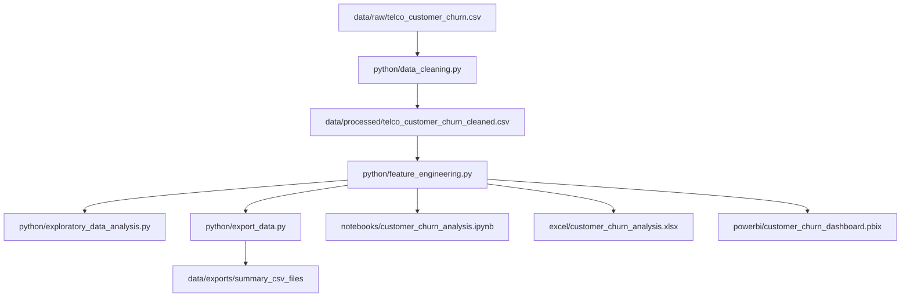

# Project Workflow & ETL Pipeline - Customer Churn Analysis

This document describes the analytical ETL (Extract, Transform, Load) workflow and the dashboard configuration pipeline.

---

## 1. Data Pipeline Overview

The project follows a modular, batch data processing workflow implemented in Python and SQL:



### ETL Stage Details:
1. **Extraction**: Raw dataset is downloaded from the raw repository using python requests and saved under `data/raw/`.
2. **Transformation**:
   - `data_cleaning.py`: Casts `TotalCharges` to numeric, converting blank spaces (which occur for customers with tenure = 0) to `0.0`. Validates duplicates and strips object padding.
   - `feature_engineering.py`: Computes custom features: binned groups (`TenureGroup`), active service counts (`TotalInternetServices`), and numeric equivalents of categorical variables (`ChurnNumeric`).
3. **Load**:
   - Save processed CSV to `data/processed/`.
   - Pre-aggregates summaries (Contract, Payment Method, and Internet Service metrics) and saves them under `data/exports/`.

---

## 2. Power BI DAX Measures & Formulas

Below are the configurations for metrics mapped in the Power BI dashboard:

- **Total Customers**:
  ```dax
  Total Customers = COUNT(telco_customer_churn_cleaned[customerID])
  ```
- **Active Customers**:
  ```dax
  Active Customers = CALCULATE(COUNT(telco_customer_churn_cleaned[customerID]), telco_customer_churn_cleaned[Churn] = "No")
  ```
- **Churned Customers**:
  ```dax
  Churned Customers = CALCULATE(COUNT(telco_customer_churn_cleaned[customerID]), telco_customer_churn_cleaned[Churn] = "Yes")
  ```
- **Churn Rate**:
  ```dax
  Churn Rate = DIVIDE([Churned Customers], [Total Customers], 0)
  ```
- **Retention Rate**:
  ```dax
  Retention Rate = DIVIDE([Active Customers], [Total Customers], 0)
  ```
- **Average Monthly Charges**:
  ```dax
  Average Monthly Charges = AVERAGE(telco_customer_churn_cleaned[MonthlyCharges])
  ```
- **Total Monthly Revenue Lost**:
  ```dax
  Total Monthly Revenue Lost = CALCULATE(SUM(telco_customer_churn_cleaned[MonthlyCharges]), telco_customer_churn_cleaned[Churn] = "Yes")
  ```
- **Average Customer Lifetime (Months)**:
  ```dax
  Average Customer Lifetime = AVERAGE(telco_customer_churn_cleaned[tenure])
  ```

---

## 3. Power BI Dashboard Layout Mappings

### Page 1: Overview
- **Visuals**:
  - KPI Cards for Total Customers, Active Customers, Churn Rate, and Avg Monthly Charges.
  - Donut Chart of Churn by Contract.
  - Column Chart of Tenure Months Distribution.
  - Horizontal Bar Chart of Churn by Payment Method.
  - Left pane slicers for Segment (SeniorCitizen), Gender, and Billing style.

### Page 2: Churn Analysis
- **Visuals**:
  - KPI Card for Monthly Revenue Lost ($139.1K).
  - Vertical Column Chart of Churn by Internet Service.
  - Line Chart of Monthly Charges Density.
  - Scatter plot showing tenure vs monthly charges.
  - Multi-row cards displaying service subscriptions.
